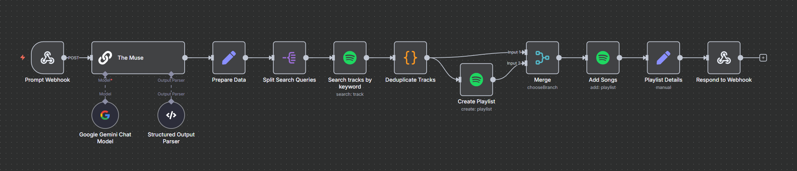

# drft — AI-Curated Playlist Muse

A fully automated music playlist generator that takes your mood or scene prompt, uses Google's Gemini chat model to 
interpret and invent playlist details, fetches tracks from Spotify, and delivers a custom playlist right into your 
Spotify account. Powered by n8n for workflow orchestration and ngrok for secure webhook tunneling, with a Python CLI 
for seamless interaction.

## Table of Contents

* [Overview](#overview)
* [Prerequisites](#prerequisites)
* [Features](#features)
* [Architecture](#architecture)
* [Setup Guide](#setup-guide)
    - [1. Clone the Repository](#1-clone-the-repository)
    - [2. Set Up ngrok Tunnel](#2-set-up-ngrok-tunnel)
    - [3. n8n Configuration & Workflow Import](#3-n8n-configuration--workflow-import)
      - [Self-Hosted n8n](#self-hosted-n8n)
      - [n8n in Website](#n8n-in-website)
    - [4. Create & Configure Spotify App](#4-create--configure-spotify-app)
* [Running the App](#running-the-app)
* [Workflow Details](#workflow-details)
* [Scripts Overview](#scripts-overview)

## Overview

**drft** automates the process of transforming your vibe or mood into a custom Spotify playlist.

- Enter any mood or scene prompt.
- The Gemini chat model (Google) generates playlist details and themed search cues with nuanced conversational understanding.
- n8n orchestrates Spotify search, deduplicates tracks, creates and fills the playlist.
- A Python CLI connects you to the entire flow, using webhooks tunneled via ngrok.

## Prerequisites

Make sure you have these installed and set up before continuing:

- [Docker Desktop](https://www.docker.com/products/docker-desktop/)  
  For running n8n containers.

- [ngrok](https://ngrok.com/download)  
  For secure public webhooks (sign up for a free account).

- [Python 3.8+](https://www.python.org/downloads/)  
  For the CLI interface. Include `pip` for Python package installation.

- [uv](https://github.com/astral-sh/uv)  
  For rapid virtual environment creation and Python dependency management.
    - Install uv as recommended:
      ```
      pip install uv
      ```

- **PowerShell 5.1+** (bundled with modern Windows 10+/11)

- A [Spotify Developer account and app](https://developer.spotify.com/dashboard/applications)

- **Google Gemini API access**  
  (Go to the [Google AI Studio](https://aistudio.google.com/app/apikey) for obtaining an API key or client credentials.)

Recommended:
- (Windows) Add Docker and ngrok executables to your PATH.

## Features

- **Natural Language Playlist Creation:** Enter any mood, scene, or feeling to curate a playlist.
- **Automated LLM Prompting:** Uses the Gemini chat model for context-aware playlist names, descriptions, and search generation.
- **Spotify Integration:** Finds and deduplicates best-matching tracks, creates and fills playlists.
- **CLI Automation:** Command-line UX with instant playback in the Spotify app.
- **Visual Workflow Orchestration:** All logic managed by n8n, easily modifiable.

## Architecture

| Component              | Function                                                                   |
|------------------------|----------------------------------------------------------------------------|
| n8n                    | Workflow orchestration & integration logic                                 |
| Gemini Chat Model      | LLM for contextual prompt-to-playlist parsing and creative naming          |
| Spotify App            | API access for playlist and track management                               |
| ngrok                  | Public webhook tunneling for local development                             |
| Python CLI             | User interaction, workflow invocation, playlist ID handoff to Powershell   |
| PowerShell Script      | Launches Spotify app and opens the created playlist                        |

## Setup Guide

### 1. Clone the Repository

```
git clone https://github.com/coeusyk/drft.git
cd drft
```

### 2. Set Up ngrok Tunnel

> **Note**: Follow this **only if** your n8n instance is **self-hosted** on Docker.

**ngrok** gives your local n8n instance a public HTTPS URL, required for Spotify webhooks and OAuth callbacks.

See [`ngrok_setup.md`](ngrok_setup.md) for more details.

### 3. n8n Configuration & Workflow Import

#### Self-Hosted n8n:

**a) Start Docker Desktop:**  
Make sure Docker Desktop is fully started and running.

**b) Run the n8n container with the configure_n8n script:**  
Execute the provided [`configure_n8n.ps1`](configure_n8n.ps1) PowerShell script. This will:
- Remove any existing n8n container
- Fetch your current ngrok public URL
- Start a new n8n container set up with that URL so your webhooks are publicly accessible

Sample usage (in PowerShell):
```
.\configure_n8n.ps1
```

Wait for the script to finish and confirm n8n is running in your Docker Desktop.

> **Note**: After completing the above steps, follow steps (c) and (d).

#### n8n in Website:

**c) Set up credentials in n8n:**  
- In your browser, open http://localhost:5678
- Go to "Credentials", and once ready, you'll need your Spotify app credentials and Google Gemini keys (see next section).

**d) Import the workflow:**  
- In n8n, choose "Import workflow" and select the provided `drft_workflow.json` file.
- Activate the workflow

### 4. Create & Configure Spotify App

**Note:**  
You need your public OAuth2 redirect URL from your n8n instance (provided after your credentials UI is generated) to 
set up the Spotify app correctly.

- Go to the [Spotify Developer Dashboard](https://developer.spotify.com/dashboard/applications) and create a new app.
- After launching n8n and opening the credentials UI, copy the redirect URI shown during Spotify OAuth2 credential setup (it will look like `https://<ngrok-subdomain>.ngrok.io/rest/oauth2-credential/callback`).
- Go back to the Spotify app dashboard and paste that URI as a redirect in your app’s settings.
- Copy your **client ID** and **client secret** into the corresponding fields in your n8n Spotify credential.

---

## Running the App

- Set up your `.venv` using uv:
    ```bash
    # Create a virtual environment
    uv venv
  
    # Activate the virtual environment
    .venv\Scripts\activate
  
    # Install required packages
    uv pip install -r requirements.txt
    ```

- Run:
    ```bash
    python main.py
    ```

- When prompted, enter your playlist mood/description.  
- The script posts to the n8n webhook, and after processing, receives the playlist ID, opens Spotify, and opens the 
  playlist via PowerShell script.

---

## Workflow Details

The drft system automates curated Spotify playlist creation using your natural-language prompt. Here’s how the workflow functions, step by step:

1. **User Prompt (Python CLI):**  
   You enter a mood or scene description (e.g., "Instrumental lofi beats for deep focus coding") in the Python CLI.

2. **Webhook to n8n (via ngrok):**  
   The CLI sends your prompt as a webhook request to your n8n instance, exposed securely on the public internet via your active ngrok tunnel.

3. **Gemini Chat Model Processing:**  
   n8n receives the webhook trigger and uses the Gemini chat model to:
   - Interpret your mood prompt
   - Generate a creative playlist name and description
   - Suggest context-aware Spotify search queries/themes

4. **Spotify Search and Deduplication:**  
   n8n uses the Gemini-generated queries to search Spotify for relevant tracks.  
   Duplicate tracks are removed to ensure unique results.

5. **Create Spotify Playlist:**  
   A new playlist is created in your Spotify account with the generated name and description.

6. **Add Tracks to Playlist:**  
   The top unique tracks are added to the new playlist.

7. **Respond with Playlist Info:**  
   The workflow returns the playlist ID and details to the Python CLI via webhook response.

**Flow Diagram:**



---

## Scripts Overview

### [`configure_n8n.ps1`](configure_n8n.ps1)

Cleans up any old n8n container and starts a new one, automatically configured with the current ngrok public URL 
so webhooks work for Spotify OAuth and external calls.

### [`start_spotify.ps1`](start_spotify.ps1)

Opens the created playlist in the Spotify desktop app using the ID from the `SPOTIFY_PLAYLIST_ID` environment variable.
